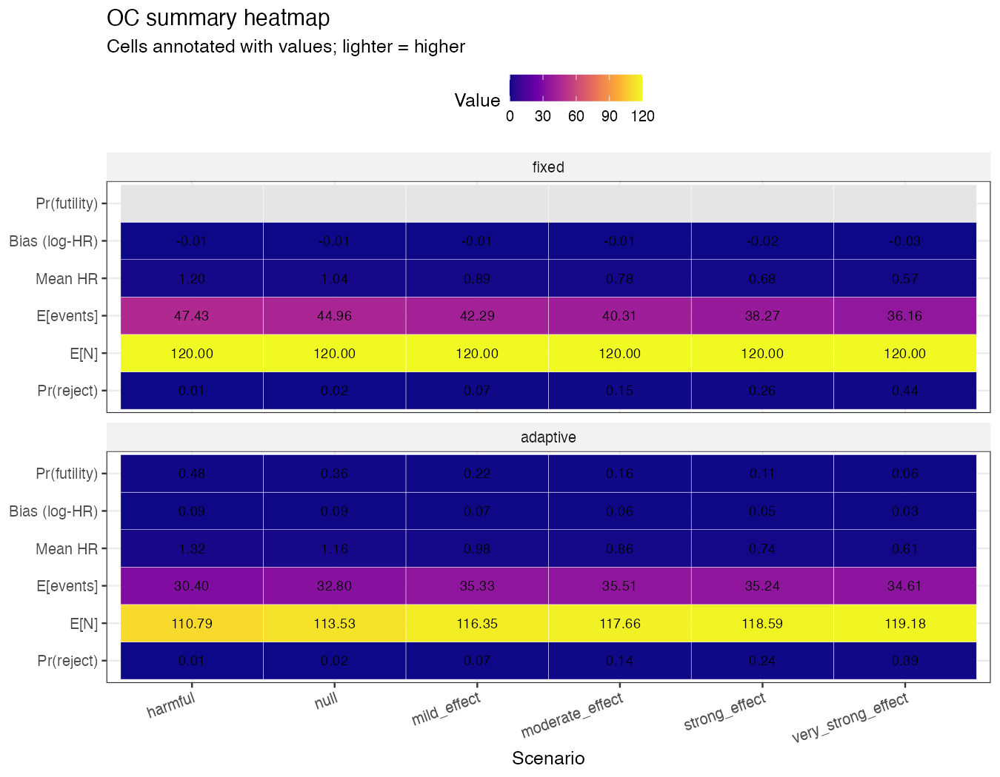

# Bayesian Adaptive Phase II Oncology Trial Simulator

> Response-adaptive randomization simulator for a Phase II oncology trial with a time-to-event primary endpoint and one event-driven interim futility analysis, plus a parallel survival analysis on TCGA-BRCA. End-to-end R + Stan + SAS, with a Quarto report and a mock SAP section in ICH E9(R1) estimand language.



**📄 Read the report:**
- **[Rendered PDF](report/index.pdf)** - full main report, rendered inline by GitHub
- **[HTML version](https://kbd0011.github.io/bayesian-adaptive-trial-sim/)** - same content as the PDF, served via GitHub Pages
- Source: [`report/index.qmd`](report/index.qmd) (main), [`report/sap_section.qmd`](report/sap_section.qmd) (mock SAP)

## Headline result

> 12,000 simulated trials (1,000 per scenario × 2 designs, ~100 s wall time, 4 furrr workers). The Bayesian adaptive design controlled **Type I at 0.019** (vs 0.021 for fixed; both ≤ 0.025 target) and stopped early for futility in **48% of trials under harmful HR** and **36% under the null**, saving 5–8% of expected sample size in those scenarios. Across non-null effects (HR 0.85 → 0.55), adaptive ceded **0.6–5.6 percentage points of power** to the fixed design - the standard adaptive-design trade-off between operational efficiency under no/harmful signal and peak power under strong signal.

## What this demonstrates

- **Adaptive trial design** with an event-driven interim (30% information time under H1, fires when 12 events accumulate) and post-interim Thompson-style response-adaptive randomization (sqrt damping + 20/80 caps, refit every 20 enrollees).
- **Frequentist group-sequential boundary** via `{rpact}` (O'Brien-Fleming alpha + beta spending), with both fixed and adaptive designs applying the same final-stage z-boundary (z = 1.969) for apples-to-apples comparison.
- **Bayesian exponential survival** at the interim, fit in Stan with a baseline-rate-centered Gamma prior on the control hazard. Compiled once, cached on disk, parallelized across `furrr` workers.
- **Parallel survival analytics** on n = 1,002 TCGA-BRCA patients: Kaplan-Meier (with log-rank + risk table), Cox PH with Schoenfeld diagnostic, Bayesian Weibull AFT with posterior-predictive KM overlay.
- **Two complementary survival models** (Cox PH non-parametric vs Weibull AFT parametric) directionally agree on the protective effect of hormone-receptor positive status and the risk-amplifying effect of age, despite a flagged proportional-hazards violation.
- **Mock SAP section** in ICH E9(R1) estimand language and CDISC-aligned analysis-population structure.
- **Reproducibility-as-code**: `Makefile`, `config.yml`, single-seed RNG, GitHub Actions CI running a reduced 100-sim version of the pipeline + the full TCGA analysis + unit tests + Quarto render on every push.

## Stack

R 4.3 · Stan / `{rstan}` / `{rstanarm}` · `{rpact}` · `{gsDesign}` · `{survival}` · `{survminer}` · `{furrr}` · `{bayesplot}` · `{posterior}` · `{flextable}` · Quarto · SAS OnDemand for Academics

## Repository structure

```
config.yml             all simulation + design parameters (no hard-coded numbers in code)
Makefile               make sims | tcga | report | test | all
R/
  00_setup.R           libs, paths, future multisession, helpers
  01_design_params.R   rpact OBF group-sequential design + interim event target
  02_sim_fixed.R       fixed-design simulator (1:1, log-rank + Cox PH on OBF z)
  03_sim_adaptive.R    adaptive simulator with event-driven Bayesian interim + RAR
  04_run_all_sims.R    furrr orchestrator (--n-sims, --workers CLI flags)
  05_oc_compute.R      operating-characteristics aggregator
  06_oc_plots.R        4 OC figures (power, E[N], futility, summary heatmap)
  07_tcga_data.R       TCGA-BRCA pull + clean (RTCGA::survivalTCGA)
  08_tcga_km.R         Kaplan-Meier by hormone-receptor status
  09_tcga_cox.R        Cox PH + Schoenfeld + stratified sensitivity
  10_tcga_bayes_aft.R  Bayesian Weibull AFT in Stan + PP KM overlay
  11_futility_sensitivity.R  futility-threshold sweep for the SAP sensitivity
stan/
  exp_survival.stan    interim Bayesian model (adaptive design)
  weibull_aft.stan     Weibull AFT model (TCGA case study)
sas/
  seqdesign.sas        PROC SEQDESIGN cross-check of rpact boundaries
  tcga_lifetest.sas    PROC LIFETEST cross-check of survminer
  tcga_phreg.sas       PROC PHREG cross-check of coxph (incl. PH assessment)
report/
  index.qmd            full Quarto report (10 sections, embeds 10 figures)
  sap_section.qmd      standalone mock SAP, ICH E9(R1) estimand structure
tests/                 testthat unit tests, run via per-file Rscript subprocesses
.github/workflows/
  ci.yml               full pipeline + tests + report render on every push
outputs/               figures (PDF + PNG) and tables (CSV)
```

## Reproducing

First-time setup (restores all R + Stan package versions pinned in `renv.lock`):

```r
# from R, in the project directory
renv::restore()
```

> **macOS note.** R's "recommended" packages (`Matrix`, `MASS`, `survival`, etc.) ship with R itself rather than being installable from CRAN. `renv::restore()` on macOS sometimes errors with `package 'Matrix' is not available` if a CRAN/PPM mirror doesn't list them separately. The renv settings in this project (`renv/settings.json` → `external.libraries` and `ignored.packages`) tell renv to source these from your R installation. If you still hit the issue, install R 4.3.1 from CRAN (`pkg.r-project.org`) first - it bundles all the recommended packages - then re-run `renv::restore()`. CI on Linux uses Posit Package Manager and doesn't see this issue.

Then:

```bash
make sims         # 12,000 trial simulations (~100 s @ 4 workers)
make tcga         # TCGA KM + Cox + Bayesian AFT pipeline (writes sas/data/tcga_brca.csv too)
make sas-data     # just the CSV export, for SAS-only users
make sensitivity  # futility-threshold sweep used in SAP §10.5 (~90 s)
make report       # render Quarto report and SAP section
make test         # testthat suite (per-file subprocess isolation)
make all          # sims + tcga + report (sensitivity not included by default)
make clean        # remove all generated outputs
```

All randomness is seeded from `CONFIG$simulation$seed = 20260513` with per-sim seeds derived as `seed + sim_id * 10 + as.integer(factor(design))`. Stan models compile once and cache to `stan/*.rds` (gitignored). Package versions are pinned via `renv` (R 4.3.1, lockfile in `renv.lock`).

**Output policy.** PNG figures (used by this README) and CSV tables are committed. PDF figures (used only by the rendered Quarto report) and the SAS-input CSV (regenerated by `R/07`) are gitignored to keep the working tree clean across re-runs. `make all` regenerates the PDFs and the SAS CSV.

## Operating-characteristics summary

| Scenario | Design | True HR | Reject rate | 95% CI | P(futility) | E[N] | E[events] | Mean HR |
|----------|--------|---------|-------------|--------|-------------|------|-----------|---------|
| null            | adaptive | 1.00 | 0.019 | (0.011, 0.030) | 0.36 | 113.5 | 32.8 | 1.16 |
| null            | fixed    | 1.00 | 0.021 | (0.013, 0.032) | -    | 120.0 | 45.0 | 1.04 |
| harmful         | adaptive | 1.15 | 0.008 | (0.003, 0.016) | 0.48 | 110.8 | 30.4 | 1.33 |
| harmful         | fixed    | 1.15 | 0.010 | (0.005, 0.018) | -    | 120.0 | 47.4 | 1.20 |
| mild            | adaptive | 0.85 | 0.075 | (0.059, 0.093) | 0.22 | 116.3 | 35.3 | 0.98 |
| mild            | fixed    | 0.85 | 0.069 | (0.054, 0.087) | -    | 120.0 | 42.3 | 0.89 |
| moderate        | adaptive | 0.75 | 0.139 | (0.118, 0.162) | 0.16 | 117.7 | 35.5 | 0.86 |
| moderate        | fixed    | 0.75 | 0.146 | (0.125, 0.169) | -    | 120.0 | 40.3 | 0.78 |
| strong          | adaptive | 0.65 | 0.238 | (0.212, 0.266) | 0.11 | 118.6 | 35.2 | 0.74 |
| strong          | fixed    | 0.65 | 0.263 | (0.236, 0.291) | -    | 120.0 | 38.3 | 0.68 |
| very_strong     | adaptive | 0.55 | 0.387 | (0.357, 0.418) | 0.06 | 119.2 | 34.6 | 0.61 |
| very_strong     | fixed    | 0.55 | 0.443 | (0.412, 0.474) | -    | 120.0 | 36.2 | 0.57 |

Full table: `outputs/tables/oc_table.csv`. Plots: `outputs/figures/oc_*.{pdf,png}`.

## TCGA-BRCA case study (n = 1,002, 97 events)

| Term | Cox PH (HR, 95% CI) | Bayes Weibull AFT (1/TR, 95% CrI) |
|---|---|---|
| HR+ vs HR- | 0.58 (0.40, 0.84) | 0.70 (0.54, 0.93) |
| Age (per decade) | 1.28 (1.10, 1.49) | 1.17 (1.07, 1.29) |

Both models agree **directionally**: HR+ is significantly protective and each decade of age significantly increases hazard. The point-estimate gap (Cox 0.58 vs Bayes 0.70 on the HR scale) is the expected behavior when proportional hazards is violated - Cox estimates a time-averaged HR while the Weibull AFT's `1/TR` correspondence to HR holds strictly only under both PH and a Weibull baseline. Schoenfeld test flags PH violation for `hr_status` (p = 0.013), so the disagreement is informative rather than reassuring. Bayes diagnostics: max R̂ = 1.003, min bulk ESS = 1,598, 4 chains × 2,000 iter in ~5 s each.

## Limitations and design choices

- **Phase II screening design.** Maximum n = 120 with 24-month follow-up is deliberately small for a Phase II go/no-go trial; rpact's sample-size calculator says n ≈ 791 would be needed for 80% power at HR = 0.70 with this alpha-spending. Power at smaller effect sizes (HR 0.75 / 0.85) is correspondingly modest. This is by design, not a misconfiguration.
- **Interim timing chosen at 30% information under H1.** A 50% interim was originally specified but, at this n and event-rate envelope, almost never accumulated the target event count before end-of-study; 30% places the interim inside the practical event-accrual window. Sensitivity analysis across alternative information fractions is on the roadmap.
- **Futility threshold (P(HR < 0.7 | data) < 0.20) is operator-defined.** A formal sensitivity analysis across alternative thresholds (0.10, 0.15, 0.30) is on the roadmap; the current threshold has not been swept.
- **Adaptive HR estimates are biased upward** (mean log-HR bias +0.03 to +0.09, decreasing with stronger true effect) due to two mechanisms: (1) futility-stopped trials report the interim Bayesian posterior median, which is pulled toward HR = 1 by the weakly informative prior; (2) RAR-induced allocation imbalance modestly inflates the Cox HR estimate under benefit. The fixed design's bias is the standard small-sample Cox attenuation (-0.01 to -0.03), opposite direction. Quantified in `report/index.qmd` §7 (bias table by scenario × design); see `outputs/tables/oc_table.csv` `bias_log_hr` column. The Cox PH analysis does not adjust for RAR-induced imbalance - an IPTW-weighted sensitivity would be the standard regulatory companion.
- **TCGA-BRCA is a survival toolkit validation, not a data-generating-model validation.** The endpoint (overall survival in breast cancer) differs from the simulator's (time-to-progression in a hypothetical oncology indication). The TCGA section demonstrates that the same Stan / KM / Cox / AFT pipeline works on real, messier data - not that the simulator's exponential data-generating model matches breast cancer biology.


## Background

- ICH E9(R1) - *Statistical Principles for Clinical Trials, Addendum on Estimands*, 2019.
- FDA - *Adaptive Designs for Clinical Trials of Drugs and Biologics*, 2019.
- O'Brien PC, Fleming TR (1979) - *A multiple testing procedure for clinical trials.* Biometrics 35: 549–556.
- Cox DR (1972) - *Regression models and life-tables.* J R Stat Soc B 34: 187–220.
- Wassmer G, Brannath W (2016) - *Group Sequential and Confirmatory Adaptive Designs in Clinical Trials.* Springer.
